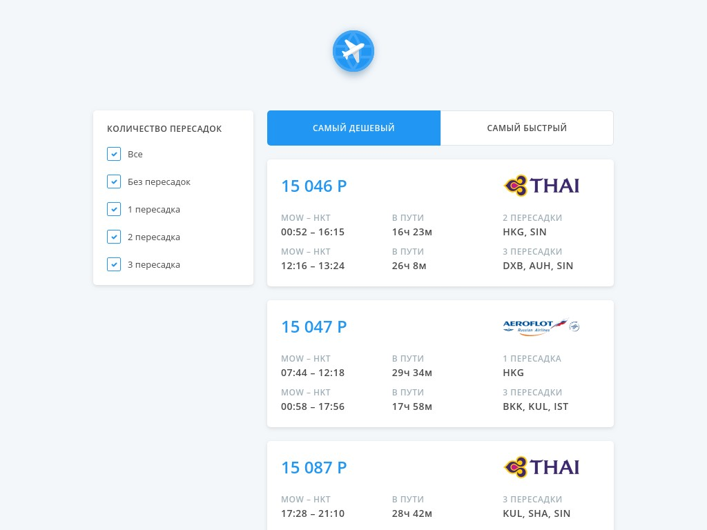

Проект собран на [Create React App](https://github.com/facebook/create-react-app).

## Тестовое задание Aviasales
Задание [тут](https://github.com/balozae/demo-avs/blob/master/docs/task.md).
Оригинал [здесь](https://github.com/KosyanMedia/test-tasks/tree/master/aviasales_frontend).

## Что реализовано
- билеты отображаются сразу как появляется первая партия
- верстка
  - perfect pixel
  - mobile first

## [Демо](https://avs-kappa.now.sh/)

## Настройка
Установи зависимости командой `yarn install`

Для настройки переменных локально нужно создать файл `.env.local`
> В приложение попадут только переменные с префиксом `REACT_APP_`

## Доступные команды

### `yarn start`

Запуск приложения в режиме разработки.
При выполнении открывается страница в браузере [http://localhost:3000](http://localhost:3000) (порт можно изменить в `.env.local`).
Страница будет перезагружена при изменении файлов.

### `yarn build`

Cоздаст оптимизированную сборку приложения в папке build. 
